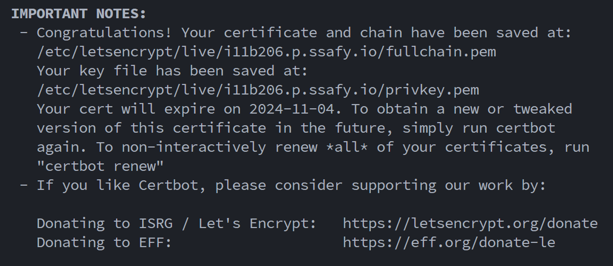
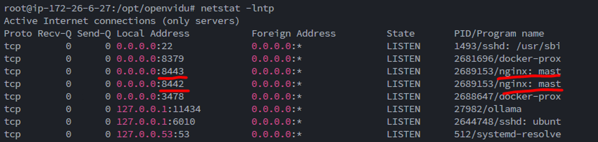
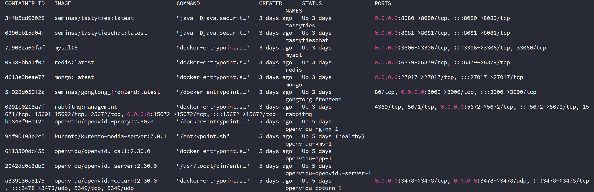
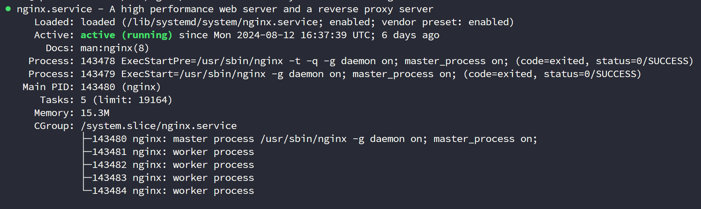

# ⚡배포 가이드
- Nginx는 설치되어 있지 않은 상태. (설치되어 있다면 완전 삭제)
- 실행 중인 컨테이너가 없는 상태 (`docker ps`로 확인)
- 추가적인 포트 점유가 없는 상태 (`netstat -lntp`로 확인)

<br>

# 1️⃣SSL 인증서 발급 및 적용
- 오픈비두 같은 경우, 카메라를 사용하기 위해 반드시 https로 이용해야 하기 때문에, SSL인증서를 발급 받아야 한다. 
- 인증서 발급을 위해서는 도메인이 필요하다.
- SSL 인증서 발급 시, 80 또는 443 포트가 방화벽에서 열려있는지 확인하자.
    - 또는 배포하는 과정에서 `ufw disable`을 통해 방화벽 설정을 해제하고, 추후 다시 닫는 것으로 하자.
- Let's Encrypt에서 발급하는 과정에서 사용되기 때문이다.

```shell
sudo apt-get install letsencrypt
sudo letsencrypt certonly --standalone -d <도메인명:i11b206.p.ssafy.io>
```




<br>

# 2️⃣Openvidu 배포
### 오픈 비두를 배포하기 위한 권한 얻기
```shell
sudo su
```

### 오픈비두를 설치하기 위해 /opt로 이동
```shell
cd /opt
```

### 오픈비두 설치
- 알파 버전 중 가장 최신 버전 사용 (2024-08-24)
```shell
curl <https://s3-eu-west-1.amazonaws.com/aws.openvidu.io/install_openvidu_2.30.0.sh> | bash
```

### 오픈비두 설치 경로로 이동
```shell
cd openvidu
```

### .env 환경 설정

```shell
nano .env
```
로 설정 파일 버퍼로 열기
- 일단 HTTP와 HTTPS 설정을 하지 않고 default로 설정하여 실행해본다.
- 아래 내용을 팀의 상황에 맞춰서 작성해주어야 한다.
- `CERTIFICATE_TYPE=letsencrypt`를 설정하여 자동으로 SSL 인증서가 적용되게 한다.

```shell
# OpenVidu configuration
# ----------------------
# 도메인 또는 퍼블릭IP 주소
DOMAIN_OR_PUBLIC_IP=i11b206.p.ssafy.io

# 오픈비두 서버와 통신을 위한 시크릿
OPENVIDU_SECRET=ssafyB206

# Certificate type
CERTIFICATE_TYPE=letsencrypt

# 인증서 타입이 letsencrypt일 경우 이메일 설정
LETSENCRYPT_EMAIL=seminkim1432@gmail.com
```

### 실행 및 종료
```shell
# 실행
./openvidu start

# 종료
./openvidu stop
```
- 실행해보면, 설정한 도메인을 기반으로 접속할 수 있는 링크가 나온다. 
- openvidu 페이지에 접속이 되는지 확인해보자.
- 성공이 되었다면 `netstat -lntp`로 포트를 확인해보자.
- 포트 확인 시 성공적으로 80과 443이 nginx에 의해 사용되고 있다면 확인을 마치고 openvidu를 종료하자.
- 우리가 사용자에게 보여줄 페이지는 openvidu가 제공하는 페이지가 아닌, 우리 팀의 프론트 페이지어야 하기 때문에, 변경할 것이다.


### .env 파일 재설정
```shell
nano .env
```
- 이번에는 HTTP와 HTTPS 설정을 한다.
- 이 설정이 필요한 이유는, openvidu 설정이 담긴 nginx 설정에 ssl을 추가하기 위함이다.
- ssl 설정을 위해서는 key가 필요한데, 앞서 설정한 `CERTIFICATE_TYPE=letsencrypt` 덕분에 자동으로 인증이 설정된다.
- 그리고 이 설정이 진행되어야 여러 명이 하나의 세션에 들어가 통신할 수 있다.
- 이렇게 외부에서 키를 받아오기 위해서 사용자의 프론트와 백엔드가 사용하는 포트를 피해서 HTTP와 HTTPS 포트를 설정해야 한다.
```shell
# HTTP port
HTTP_PORT=8442

# HTTPS port
HTTPS_PORT=8443
```

### 실행 및 포트 확인
```shell
# 실행
./openvidu start

# 포트 확인
netstat -lntp
```
- 이전에는 80, 443포트를 Nginx가 점유하고 있었다면, 지금은 8442, 8443 포트가 점유하고 있어야 한다.



### 설정 후 오픈비두 배포
```shell
docker-compose up -d
```

위 과정이 성공했다면, 
- USER : OPENVIDUAPP
- 비밀번호 : ssafyB206
- `:8443/dashboard`로 하여 대시보드 접속이 가능해야 한다.

<br>


# 3️⃣프로젝트 설정 + 도커 이미지 생성

## 📌Git
- 계정 및 토큰 발급
```shell
git clone https://github.com/Tasty-Ties/Tasty-Ties.git
```

<br>

## 📌DockerHub
- DockerHub 접속 및 가입
- 엑세스 토큰 생성
- 도커 이미지를 올리고 내려받아 docker-compose를 통해 배포한다.
    - 이를 통해, 추후 로컬에서 빌드한 도커 이미지를 배포 환경에서 사용할 수 있게 된다.

```shell
docker login -u <계정:seminss>
```

<br>

## 📌메인서버(tastyties)
>  Java17, Springboot 3.2
- 로컬에서도 진행 가능하다. (인텔리제이 가능)

### Dockerfile 작성
- 프로젝트 최상단에 작성한다.
```shell
# Start with a base image containing Java runtime
FROM openjdk:17-jdk-slim

# Add a volume pointing to /tmp
VOLUME /tmp

# Make port 8080 available to the world outside this container
EXPOSE 8080

# The application's jar file
ARG JAR_FILE=build/libs/tastyties-0.0.1-SNAPSHOT.jar

# Add the application's jar to the container
COPY ${JAR_FILE} app.jar

COPY ./src/main/resources/data.sql /app/resources/data.sql

# Run the jar file
ENTRYPOINT ["java","-Djava.security.egd=file:/dev/./urandom","-jar","/app.jar"]
                                                             
```

### security 설정
- 스프링 시큐리티를 적용 중이라면, 해당 주소를 허용해야 접속이 가능하다.
- `backend/tastyties/src/main/java/com/teamcook/tastyties/security/config/SecurityConfig.java`
```java
configuration.addAllowedOrigin("https://i11b206.p.ssafy.io");
```
### application.properties는 환경 변수로 구성한다.
- `backend/tastyties/src/main/resources/application.properties` 참고

### .env 설정
- 빌드를 위해 application.properties에 필요한 환경 변수를 할당한다.
- 만약 로컬에서 빌드를 진행할 예정이라면, 로컬 환경에 맞춰 지정하자.
```shell
#로컬에 대한 설정
SERVER_PORT=8080
SERVER_SSL_ENABLED=false
OPENVIDU_URL=http://localhost:4443/
OPENVIDU_SECRET=MY_SECRET
DB_URL=jdbc:mysql://localhost:3306/tastyties
DB_USERNAME=
DB_PASSWORD=
ADMIN_PWD=
JWT_SECRET=
JWT_ACCESS_TOKEN_EXPIRATION=360000
JWT_REFRESH_TOKEN_EXPIRATION=604800000
UPLOAD_IMAGE_DIR=C:\\Users\\SSAFY\\ssafy\\files\\image
UPLOAD_VIDEO_DIR=C:\\Users\\SSAFY\\ssafy\\files\\video
FILE_SERVER_URL=http://localhost:8080/api/v1
REDIS_HOST=localhost
REDIS_PORT=6379
AWS_ACCESS_KEY=
AWS_SECRET_KEY=
AWS_BUCKET_NAME=
RABBITMQ_HOST=localhost
RABBITMQ_PORT=5672
RABBITMQ_USERNAME=guest
RABBITMQ_PASSWORD=guest
```

### 테스트 제외하고 빌드
- 프로젝트 최상단에서 진행한다. (build.gradle이 있는 위치)
```shell
./gradlew build -x test
```

### 도커 이미지 생성
```shell
docker build --no-cache -t seminss/tastyties:latest .
docker build --no-cache -t <계정명>/<이미지명>:<태그명> .
```

### 도커 이미지를 도커 허브에 업로드
```shell
docker push seminss/tastyties:latest
docker push <계정명>/<이미지명>:<태그명>
```

<br>

## 📌채팅서버(tastyties)
>  Java17, Springboot 3.2
- 로컬에서도 진행 가능하다. (인텔리제이 가능)

### Dockerfile 작성
- 프로젝트 최상단에 작성한다.
```shell
# Start with a base image containing Java runtime
FROM openjdk:17-jdk-slim

# Add a volume pointing to /tmp
VOLUME /tmp

# Make port 8081 available to the world outside this container
EXPOSE 8081

# The application's jar file
ARG JAR_FILE=build/libs/tastytieschat-0.0.1-SNAPSHOT.jar

# Add the application's jar to the container
COPY ${JAR_FILE} app.jar

# Run the jar file
ENTRYPOINT ["java","-Djava.security.egd=file:/dev/./urandom","-jar","/app.jar"]
                                                             
```

### security 설정
- 스프링 시큐리티를 적용 중이라면, 해당 주소를 허용해야 접속이 가능하다.
- `backend/tastytieschat/src/main/java/com/teamcook/tastyties/security/config/SecurityConfig.java`
```java
configuration.addAllowedOrigin("https://i11b206.p.ssafy.io");
```
### application.properties는 환경 변수로 구성한다.
- `backend/tastytieschat/src/main/resources/application.properties` 참고

### .env 설정
- 빌드를 위해 application.properties에 필요한 환경 변수를 할당한다.
- 만약 로컬에서 빌드를 진행할 예정이라면, 로컬 환경에 맞춰 지정하자.
```shell
#로컬에 대한 설정
SERVER_PORT=8081
DB_URL=jdbc:mysql://localhost:3306/tastyties
DB_USERNAME=
DB_PASSWORD=
MONGO_HOST=localhost
MONGO_PORT=27017
MONGO_DATABASE=
MONGO_USERNAME=
MONGO_PASSWORD=
REDIS_HOST=localhost
REDIS_PORT=6379
RABBITMQ_HOST=localhost
RABBITMQ_PORT=5672
RABBITMQ_USERNAME=guest
RABBITMQ_PASSWORD=guest
OPENAI_SECRET_KEY=
SPEECH_FLOW_KEY_ID=
SPEECH_FLOW_KEY_SECRET=
CLOVA_CLIENT_ID=
CLOVA_CLIENT_SECRET=
```

### 테스트 제외하고 빌드
- 프로젝트 최상단에서 진행한다. (build.gradle이 있는 위치)
```shell
./gradlew build -x test
```

### 도커 이미지 생성
```shell
docker build --no-cache -t seminss/tastytieschat:latest .
docker build --no-cache -t <계정명>/<이미지명>:<태그명> .
```

### 도커 이미지를 도커 허브에 업로드
```shell
docker push seminss/tastytieschat:latest
docker push <계정명>/<이미지명>:<태그명>
```

<br>

## 📌프론트서버 + Nginx
>  React

### nginx.conf 작성
- 프로젝트 최상단에 작성한다.
- `/app/dist`는 빌드 파일 위치다. 
```
server {
    listen 3000;
    server_name localhost;

    location / {
        root /app/dist;
        index index.html;
        try_files $uri $uri/ /index.html;
    }
}
```
### Dockerfile 작성
- 프로젝트 최상단에 작성한다.
```shell
# Dockerfile

# nginx 이미지를 사용한다. 뒤에 tag가 없으면 latest 를 사용한다.
FROM nginx

# root 에 app 폴더를 생성
RUN mkdir /app

# work dir 고정
WORKDIR /app

# work dir 에 build 폴더 생성 /app/build
RUN mkdir ./build

# host pc의 현재경로의 build 폴더를 workdir 의 build 폴더로 복사
COPY ./dist ./dist

# nginx 의 default.conf 를 삭제
RUN rm /etc/nginx/conf.d/default.conf

# host pc 의 nginx.conf 를 아래 경로에 복사
COPY ./nginx.conf /etc/nginx/conf.d

# 3000 포트 오픈
EXPOSE 3000

# container 실행 시 자동으로 실행할 command. nginx 시작함
CMD ["nginx", "-g", "daemon off;"]

```

### .env 설정
- 배포 환경에 맞게 작성한다.
```
VITE_MAIN_SERVER=https://i11b206.p.ssafy.io/api/v1
VITE_FRONT_SERVER=https://i11b206.p.ssafy.io/
VITE_CHAT_SERVER=wss://i11b206.p.ssafy.io/chat
VITE_CHAT_SERVER_URL=https://i11b206.p.ssafy.io/chatapi

# firebase
VITE_FIREBASE_API_KEY=
VITE_FIREBASE_AUTO_DOMAIN=
VITE_FIREBASE_PROJECT_ID=
VITE_FIREBASE_STORAGE_BUCKET=
VITE_FIREBASE_MESSAGING_SENDER_ID=
VITE_FIREBASE_APP_ID=
VITE_FIREBASE_VAPID_KEY=
```

### 빌드
- 프로젝트 최상단에서 진행한다.
```shell
npm run build
```

### 도커 이미지 생성
```shell
docker build -t seminss/frontend:npm <태그> .
docker build -t seminss/frontend:latest .
```

### 도커 이미지를 도커 허브에 업로드
```shell
docker push seminss/frontend:<태그>
docker push seminss/frontend:latest
```

<br>

# 4️⃣어플리케이션 배포
#### `메인 서버`, `채팅 서버`, `프론트 서버`, `Redis`, `RabbitMQ`, `MySQL`, `MongoDB`에 대하여, **DockerHub & docker-compose** 를 이용한 배포

### 네트워크 생성
- 도커 컨테이너가 동일한 네트워크 상에서 동작하도록 하기 위함이다.
- 아래 명령어를 통해 네트워크를 미리 생성해주지 않으면 에러가 난다.
```shell
docker network create shared_network
```

### docker-compose.yml 파일 작성
- 앞서 .env 파일에 설정해둔 환경 변수 값이 로컬 환경을 위한 것(빌드를 위한 것) 이었다면, 이제는 정말 배포를 위한 환경 변수로 설정한다.
- 앞서 설정한 환경 변수는 docker-compose에 의해 덮어 씌워진다.

```yml
services:
  frontend:
    image: seminss/frontend:latest #앞서 도커 허브에 올린 이미지를 사용한다.
    container_name: frontend #컨테이너 이름
    restart: always
    ports:
      - "3000:3000"
    networks:
      - shared_network
  
  tastyties:
    image: seminss/tastyties:latest
    container_name: tastyties
    restart: always
    ports:
      - "8080:8080"
    depends_on: #tastyties 컨테이너가 올라가기 전에 미리 올라가야 하는 컨테이너 지정.
      - db
      - redis
      - rabbitmq
    environment:
      SERVER_PORT: 8080
      OPENVIDU_URL: https://i11b206.p.ssafy.io:8443/ #앞서 설정한 오픈비두의 https 포트로 지정
      OPENVIDU_SECRET: #오픈비두 시크릿 키, 임의 설정
      DB_URL: jdbc:mysql://db:3306/tastyties #db라는 컨테이너에서 tastyties라는 데이터베이스
      DB_USERNAME: # mysql 계정
      DB_PASSWORD: # mysql PWD
      UPLOAD_IMAGE_DIR: /app/files/image
      UPLOAD_VIDEO_DIR: /app/files/video
      FILE_SERVER_URL: http://localhost:8080/api/v1/files
      REDIS_HOST: redis
      REDIS_PORT: 6379
      AWS_ACCESS_KEY: #S3 ACCESS KEY
      AWS_SECRET_KEY: #S3 SECRET KEY
      AWS_BUCKET_NAME: #S3 버킷 이름
      RABBITMQ_HOST: rabbitmq
      RABBITMQ_PORT: 5672
      RABBITMQ_USERNAME: # RabbitMQ는 배포 환경에서 guest로 접속 불가, 별도의 admin 계정 생성
      RABBITMQ_PASSWORD: # RabbitMQ PWD
      ADMIN_PWD: #어플리케이션의 관리자 계정 PWD
    volumes:
      - /home/ubuntu/b206/S11P12B206/backend/tastyties/tastyties/src/main/resources/serviceAccountKey.json:/src/main/resources/serviceAccountKey.json #파이어베이스 키 볼륨 설정
    networks:
      - shared_network

  tastytieschat:
    image: seminss/tastytieschat:latest
    container_name: tastytieschat
    restart: always
    ports:
      - "8081:8081"
    depends_on:
      - mongo
      - rabbitmq
      - redis
    environment:
      SERVER_PORT: 8081
      DB_URL: jdbc:mysql://db:3306/tastyties
      DB_USERNAME: # mysql 계정
      DB_PASSWORD: # mysql PWD
      MONGO_HOST: mongo
      MONGO_PORT: 27017
      MONGO_DATABASE: tastyties
      MONGO_USERNAME: # mongoDB 계정
      MONGO_PASSWORD: # mongoDB PWD
      RABBITMQ_HOST: rabbitmq
      RABBITMQ_PORT: 5672
      RABBITMQ_USERNAME: # RabbitMQ admin 계정
      RABBITMQ_PASSWORD: # RabbitMQ admin PWD
      OPENAI_SECRET_KEY: # OPEN AI (GPT) SECRET KEY
      SPEECH_FLOW_KEY_ID: # 클로바 CLIENT SCERET(현재는 사용 x)
      SPEECH_FLOW_KEY_SECRET: # 클로바 CLIENT SCERET(현재는 사용 x)
      FFMPEG_PATH: /usr/local/bin/ffmpeg # (현재는 사용 x)
      CLOVA_CLIENT_ID: # 클로바 CLIENT SCERET(현재는 사용 x)
      CLOVA_CLIENT_SECRET: # 클로바 CLIENT SCERET(현재는 사용 x)
      REDIS_HOST: redis
      REDIS_PORT: 6379
    volumes:
      - /home/ubuntu/b206/S11P12B206/backend/tastytieschat/src/main/resources/serviceAccountKey.json:/src/main/resources/serviceAccountKey.json
    networks:
      - shared_network

  db: #여기서 설정한 걸 프&백 어플리케이션에서 사용하는 것
    image: mysql:8
    container_name: mysql
    environment:
      MYSQL_ROOT_PASSWORD: # mysql 루트 비밀번호
      MYSQL_DATABASE: # 사용할 데이터베이스
      MYSQL_USER: # 사용할 계정
      MYSQL_PASSWORD: # 사용한 계정 PWD
    ports:
      - "3306:3306"
    volumes:
      - mysql_data:/var/lib/mysql
    networks:
      - shared_network

  mongo:
    image: mongo:latest
    container_name: mongo
    ports:
      - "27017:27017"
    environment:
      MONGO_INITDB_ROOT_USERNAME: # mongoDB 루트 계정 이름
      MONGO_INITDB_ROOT_PASSWORD: # mongoDB 루트 비밀번호
    volumes:
      - mongo_data:/data/db
    networks:
      - shared_network

  rabbitmq:
    image: rabbitmq:management
    container_name: rabbitmq
    ports:
      - "5672:5672"
      - "15672:15672"
    environment:
      RABBITMQ_DEFAULT_USER: # RabbitMQ admin 계정
      RABBITMQ_DEFAULT_PASS: # admin 계정 비밀번호
    volumes:
      - rabbitmq_data:/var/lib/rabbitmq
    networks:
      - shared_network

  redis:
    image: redis:latest
    container_name: redis
    ports:
      - "6379:6379"
    volumes:
      - redis_data:/data
    command: redis-server --appendonly yes --save "900 1" --save "300 10" --save "60 10000"
    networks:
      - shared_network

volumes:
  mysql_data:
  mongo_data:
  redis_data:
  rabbitmq_data:
  tastytieschat:
  tastyties:

networks:
  shared_network:
    external: true
```

### 컨테이너 실행
```shell
docker-compose up -d
```


최종적으로 실행중인 컨테이너는 위와 같아야 한다.


<br>

# 5️⃣nginx (리버스 프록시)

### nginx 설치
```shell
# 설치
sudo apt-get install nginx

# 설치 확인 및 버전 확인
nginx -v
```
### nginx.conf
- `/etc/nginx.conf` 기본 파일을 연다.
- 주요 변경 점
    - user는 root로 변경
    - http에 `include /etc/nginx/conf.d/*.conf;` , `include /etc/nginx/sites-enabled/*;` 와 같은 두 include를 진행
```shell
user root;
worker_processes auto;
pid /run/nginx.pid;
include /etc/nginx/modules-enabled/*.conf;

events {
        worker_connections 768;
}

http {

        ...

        access_log /var/log/nginx/access.log;
        error_log /var/log/nginx/error.log;

        ...

        include /etc/nginx/conf.d/*.conf;
        include /etc/nginx/sites-enabled/*;
}

```

### deploy-test.conf
- `/ect/nginx/sites-available/deploy-test.conf`
- 파일 명은 얼마든지 변경 가능, but nginx.conf에 반드시 import 해야 한다.
- `/etc/letsencrypt/live/i11b206.p.ssafy.io/fullchain.pem`과 `ssl_certificate_key /etc/letsencrypt/live/i11b206.p.ssafy.io/privkey.pem`는 반드시 지정한 경로에 있는지 확인하자. 아니라면 에러가 난다.

```shell
upstream frontend {                                                                
    server localhost:3000;                                   
}                                                                  
                                                     
upstream backend {                                                                 
    server localhost:8080;                                                       
}                                                                                  
                                                                   
upstream chatend {
    server localhost:8081;                                                         
}      

server {
    listen 80;
    server_name i11b206.p.ssafy.io;

    # HTTP 요청은 HTTPS로 리다이렉션 할게요
    if ($host = i11b206.p.ssafy.io) {
        return 301 https://$host$request_uri;
    }

    return 404;
}

server {
    listen 443 ssl;
    server_name i11b206.p.ssafy.io;

    ssl_certificate /etc/letsencrypt/live/i11b206.p.ssafy.io/fullchain.pem;
    ssl_certificate_key /etc/letsencrypt/live/i11b206.p.ssafy.io/privkey.pem;

    root /home/ubuntu/b206/S11P12B206/frontend/gongtong_front;

    location / { #/로 들어오면 frontend 서버로 연결할게요
        proxy_pass http://frontend;
        proxy_set_header Host $host;
        proxy_set_header X-Real-IP $remote_addr;
        proxy_set_header X-Forwarded-For $proxy_add_x_forwarded_for;
        proxy_set_header X-Forwarded-Proto $scheme;

        # CORS settings
        add_header 'Access-Control-Allow-Origin' '*';
        add_header 'Access-Control-Allow-Methods' 'GET, POST, OPTIONS, DELETE, PUT';
        add_header 'Access-Control-Allow-Headers' 'Authorization, Content-Type, X-Requested-With';

        if ($request_method = 'OPTIONS') {
            return 204;
        }
    }

    location /api/v1 { #/api/v1로 들어오면 backend 서버로 연결할게요
        proxy_pass http://backend;
        proxy_set_header Host $host;
        proxy_set_header X-Real-IP $remote_addr;
        proxy_set_header X-Forwarded-For $proxy_add_x_forwarded_for;
        proxy_set_header X-Forwarded-Proto $scheme;

        # CORS settings
        add_header 'Access-Control-Allow-Origin' '*';
        add_header 'Access-Control-Allow-Methods' 'GET, POST, OPTIONS, DELETE, PUT';
        add_header 'Access-Control-Allow-Headers' 'Authorization, Content-Type, X-Requested-With';

        if ($request_method = 'OPTIONS') {
            add_header 'Access-Control-Allow-Origin' '*';
            add_header 'Access-Control-Allow-Methods' 'GET, POST, OPTIONS, DELETE, PUT';
            add_header 'Access-Control-Allow-Headers' 'Authorization, Content-Type, X-Requested-With';
            return 204;
        } 
   }

   location /chat { #/chat으로 들어오면 채팅 서버 중, 웹소켓 연결을 할게요
        proxy_pass http://chatend;
        proxy_http_version 1.1;
        proxy_set_header Upgrade $http_upgrade;
        proxy_set_header Connection "upgrade";
        proxy_set_header Host $host;
        proxy_cache_bypass $http_upgrade;
        proxy_read_timeout 3600s;
        proxy_send_timeout 3600s;
        proxy_buffering off;
    }

    location /chatapi {  #/chatapi로 들어오면 채팅 서버 중, REST API 연결을 할게요
        proxy_pass http://chatend;
        proxy_set_header Host $host;
        proxy_set_header X-Real-IP $remote_addr;
        proxy_set_header X-Forwarded-For $proxy_add_x_forwarded_for;
        proxy_set_header X-Forwarded-Proto $scheme;
    }

    location = /favicon.ico {
        log_not_found off;
        access_log off;
    }
}
```
- `/api/v1`으로 잡힌 것은 메인 서버, `/chat`과 `/chatapi`는 채팅 서버다.
- 채팅 서버는 웹소켓과 REST API를 모두 제공한다. 따라서 웹소켓은 `/chat/pub ..` `/chat/sub ..`으로 경로가 잡혀 있었고, REST API는 `/chat/api/v1` 와 같은 경로를 사용했다. 그러나 이렇게 하니, 채팅 서버로 들어가는 요청을 nginx에서 구분하지 못해, 프론트의 요청이 메인서버로 들어가 404가 뜨는 문제 발생했다. 따라서 채팅 서버의 REST API 경로를 `/chatapi`로 구분하게 되었다. 
- 다시 돌아간다면 메인 서버의 context path를 `/tastyties`, 채팅 서버의 context path를 `/tastytieschat`으로 명확히 구분해서 nginx에서 생길 문제를 미연에 방지할 것이다.

### nginx 동작 확인
```shell
systemctl status nginx
```
- nginx는 docker로 띄우지 않았다. 우분투에서 동작한다.



배포 끝입니다. :D

배포를 완료한 뒤 참고할만한 가이드는 `배포상세.md`를 참고해주세요.

## 


### 참고 자료 
- https://roasted-pharaoh-ec9.notion.site/Openvidu-30add9273abf4cf8957ca0028ee48669
- https://github.com/yesfordev/homedong/blob/develop/git%20%EC%86%8C%EC%8A%A4%20%ED%81%B4%EB%A1%A0%20%EC%9D%B4%ED%9B%84%20%EB%B9%8C%EB%93%9C%20%EB%B0%8F%20%EB%B0%B0%ED%8F%AC%20%EA%B0%80%EC%9D%B4%EB%93%9C.md

문의사항은 김세민에게(seminkim1432@gamil.com) 📧